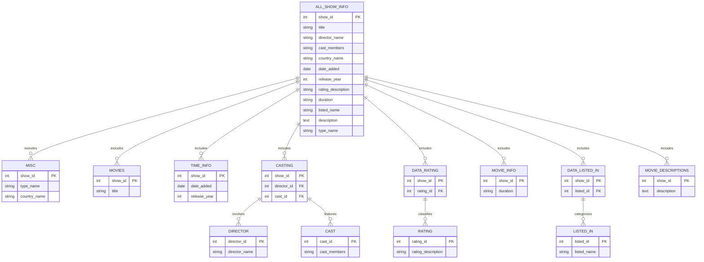

# Netflix Database Entity-Relationship Diagram (ERD)

## Overview
This ERD (Entity-Relationship Diagram) provides a visual representation of the relationships between the various tables in the Netflix shows and movies database. It is designed to help users understand how different tables are interconnected and how data flows within the database. 

## ERD Diagram
To view the ERD, you can use tools that support the Mermaid syntax. Below is the ERD code written in Mermaid format:

## How to Use
1. Copy the Mermaid code provided below.
2. Paste it into a Mermaid-compatible viewer or online tool.
3. The tool will render a visual diagram based on the code.

This ERD is a comprehensive guide to understanding the structure and relationships within the Netflix shows and movies database.
